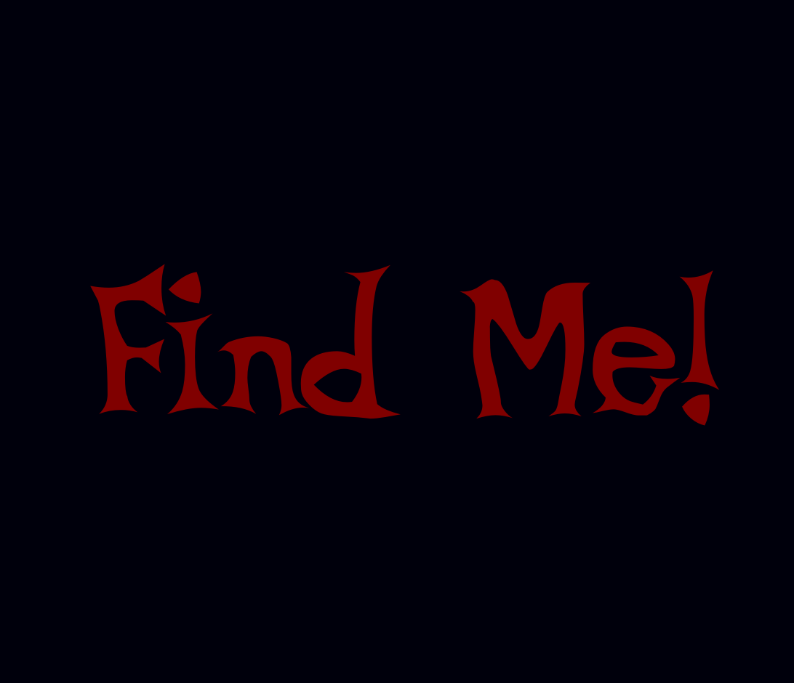
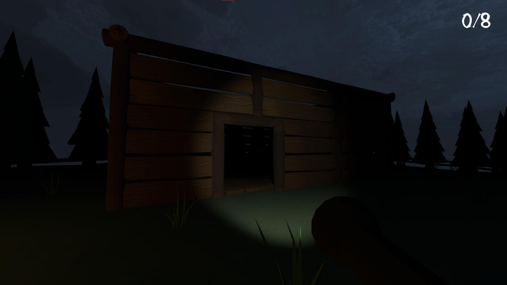
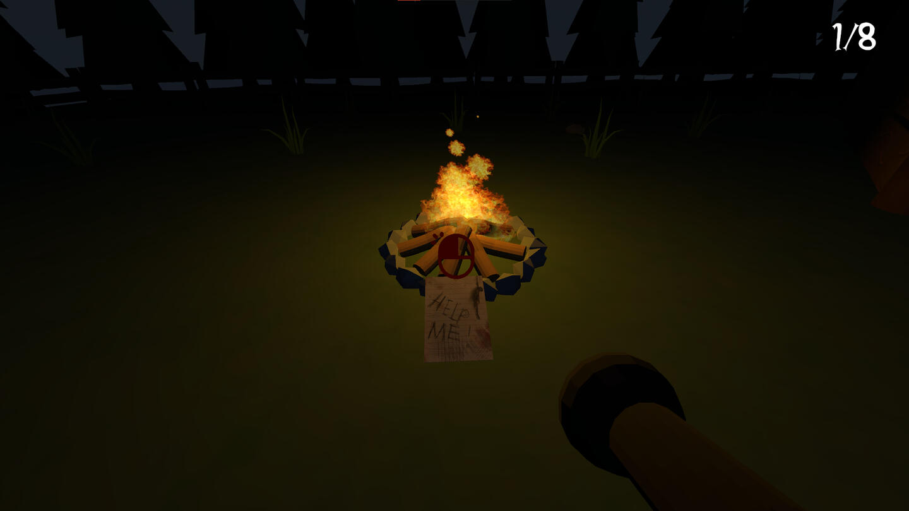
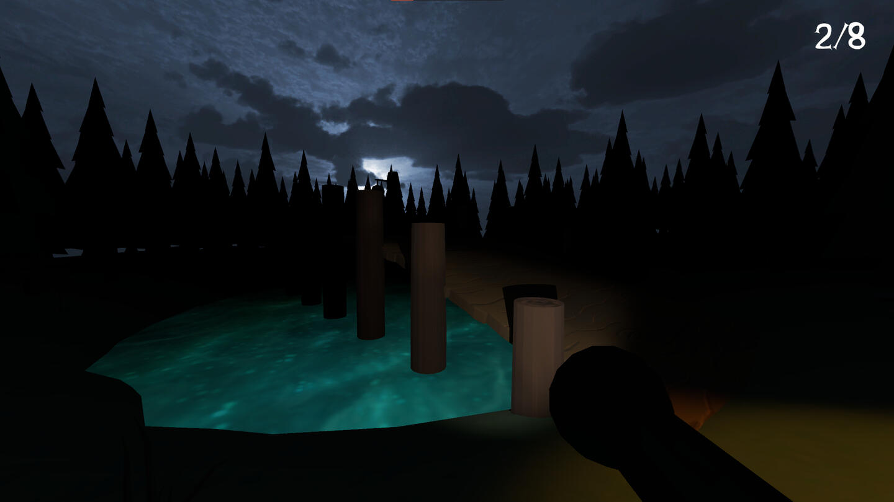
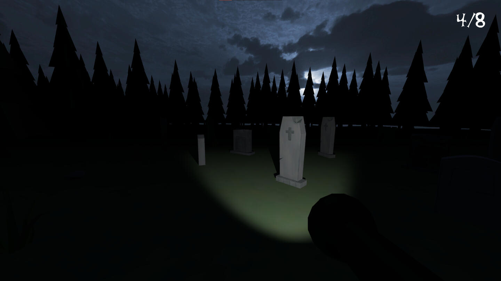
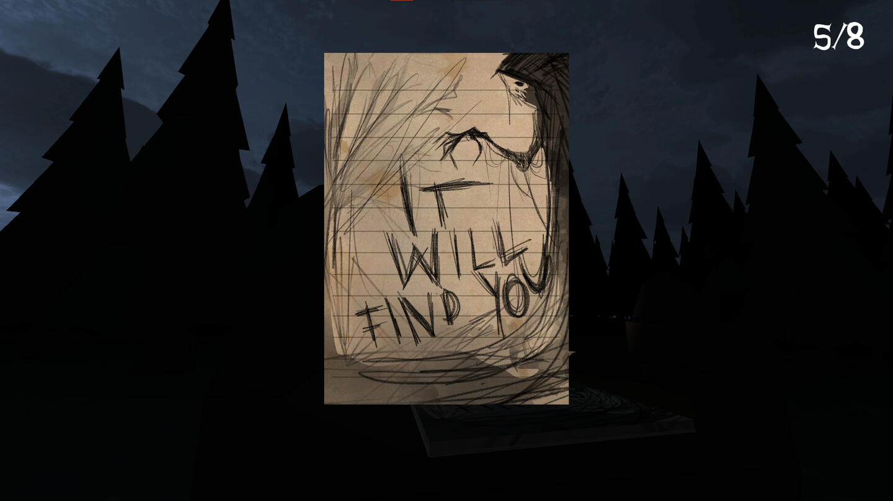

 
  

<h1 align="center"> Find Me! </h1>

<h2>About The Project</h2>

 
  This project is a short horror game inspired by the Slenderman games genre. Player wakes up in the forest, equipped only with a small, dim flashlight. In the eerie atmosphere, they have to look for creepy notes, each one depicting different, nightmarish images. After collecting all of them, only one last task remains. Go back to where it all started.

<h2>Instalation</h2>

<h3>Unity Project</h3>

- Clone the repository into your local machine
- Install the required Unity version
- Open the project

<h3>Release</h3>

- Download the release version
- Unpack the zip archive
- Launch the executable

<h2>Controls</h2>

- WASD - Movement
- F - Flashlight
- LMB - Interaction
- ESC - Menu

<h2>Usage</h2>

- When the game is launched, players start in the main menu
- They can check out the settings or start a new game

<h2>Gameplay Screenshots</h2>

  

  

  

  

  

